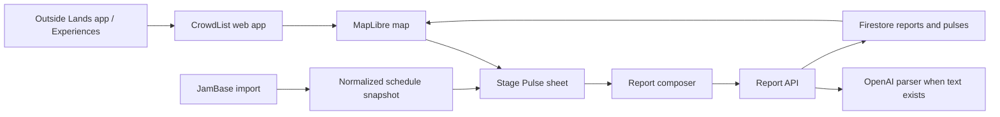

# CrowdList V1 Product and Build Specification

| Field | Value |
| --- | --- |
| Product | CrowdList |
| Version | 2.0 — streamlined hackathon scope |
| Date | August 2, 2026 |
| Event | OutsideLLMS 2026 / Outside Lands 2026 |
| Delivery | Public mobile website opened from the OutsideLLMS Experiences gallery |
| V1 objective | Ship one complete, reliable live-map loop |

## 1. Authoritative build directive

Build **V1 only**.

V1 is complete when a visitor can open CrowdList, immediately see the official
Outside Lands map brought to life, locate themselves, tap a stage, understand
its current pulse, submit a quick observation, and see that observation change
the map.

The implementation should favor a finished vertical slice over scaffolding for
future features. Do not create V2 screens, empty navigation items, placeholder
recommendations, route controls, chat launchers, setlist tabs, or generalized
festival abstractions during the first pass.

When external data or venue connectivity is unavailable, use the checked-in
Outside Lands fixture and deterministic demo state described here. Missing
credentials must not prevent the core map from running locally.

### V1 in one sentence

> CrowdList turns the official Outside Lands map into a Strava-style live
> activity map powered by fresh fan observations.

### Product position

CrowdList is a focused live spatial layer, not a replacement festival app and
not a chatbot with a map attached. The map is the product. OpenAI helps convert
natural fan language into trustworthy map signals, but conversation remains
secondary to direct touch interaction.

## 2. Product boundary

The official Outside Lands app remains the system of record for the festival.
CrowdList should repeat only the minimum context needed to understand a live
stage signal.

| Official Outside Lands app owns | CrowdList V1 adds |
| --- | --- |
| Complete lineup and artist pages | Current and next performer on a tapped stage |
| Schedule, favorites, and personal planning | Live stage activity and crowd-comfort pulse |
| Static map, directory, food, and amenities | Interactive activity overlay on the familiar map |
| Official alerts, safety, policies, and logistics | Clearly labeled, time-stamped fan observations |
| Tickets, wristbands, and transportation | A fast way to contribute what is happening now |
| Experiences catalog | One map-first experience launched from that catalog |

V1 must not add a full schedule browser, favorites, artist profiles, food or
amenity directories, ticketing, official alerts, FAQs, or transportation
guidance. When those are needed, direct the visitor back to Outside Lands.

## 3. Phase plan

### 3.1 V1 — build now

| Capability | V1 behavior |
| --- | --- |
| Map shell | Full-screen mobile map with the official 2026 patron map as its visual base |
| Stage layer | Seven tappable stage hotspots with distinct live states |
| User location | Browser location puck after an explicit tap; deterministic demo location fallback |
| Schedule context | JamBase-linked `now` and `next` labels only |
| Stage Pulse | Crowd comfort, energy, trend, freshness, and recent report count |
| Live reports | Quick structured chips plus optional short natural-language detail |
| OpenAI | Parse optional report text into a validated, structured live signal |
| Realtime | A submitted report updates the selected stage and map activity layer |
| Demo mode | Seeded pulses, schedule snippets, and repeatable state transitions |
| Attribution | Visible JamBase attribution wherever its data is displayed |

### 3.2 V2 — build only after V1 is demo-stable

- Personalized **Next Move** recommendations.
- A secondary **Ask CrowdList** conversational sheet.
- Stage-to-stage walking paths and crowd-aware routing.
- Taste, must-see, and crowd-tolerance preferences.
- Song recognition as one signal in a crowd-verified rolling setlist.
- PWA installation and stronger offline behavior.
- Report reputation, richer moderation, and confidence modeling.

Song recognition is intentionally preserved here. It is not required for V1.
In V2, recognition output must remain provisional until corroborated by another
source or independent fan reports; it must never silently become canonical.

### 3.3 Later

- Privacy-preserving passive aggregate location signals.
- Friend groups, shared plans, and personal festival memories.
- Organizer analytics and operations tooling.
- Multi-festival ingestion and reusable venue geometry.

## 4. V1 experience

### 4.1 Entry state

The Outside Lands app opens its `Experiences` destination, the user selects
CrowdList, and the public site loads directly into the map. There is no landing
page, account wall, preference quiz, or chat greeting.

On first render:

1. Show the festival map and seeded stage pulses immediately.
2. Fit the camera to the festival grounds.
3. Show a compact legend explaining activity color and freshness.
4. Keep location permission unrequested until the user taps the location button.
5. Offer a small `Demo live` badge when fixture mode is active.

### 4.2 Map interaction

- Pan and zoom use familiar mobile map gestures.
- A stage hotspot shows its name and current activity through color, halo, and
  restrained motion.
- Tapping a hotspot opens a bottom sheet without hiding the spatial context.
- The bottom sheet can be dragged or dismissed.
- Tapping `Report here` opens the report composer for that stage.
- A successful report closes the composer, animates the stage once, and updates
  its pulse.

### 4.3 Stage Pulse sheet

The sheet contains only:

1. Stage name.
2. `Now` and `Next` performer snippets.
3. Crowd-comfort label.
4. Energy label and trend.
5. Freshness, such as `updated 3 min ago from 8 reports`.
6. Two or three recent short observations.
7. Primary `Report here` action.
8. Small JamBase attribution when its data appears.

It does not contain an artist biography, full schedule, recommendation carousel,
route planner, setlist, or embedded chat.

### 4.4 Report flow

The report composer is optimized for ten seconds or less:

1. The selected stage is already set.
2. Choose one crowd chip: `Easy`, `Comfortable`, `Busy`, or `Packed`.
3. Choose one energy chip: `Chill`, `Building`, or `Electric`.
4. Optionally enter up to 140 characters, for example:
   `Sutro is getting packed but the energy is amazing.`
5. Submit.

Structured chips are sufficient, so reporting still works when OpenAI is
unavailable. When text is supplied, the server asks OpenAI for a structured
interpretation, validates it, and uses only supported fields. The original text
may be shown as a recent observation after basic moderation.

### 4.5 Location flow

Location is useful for orientation, not required for crowd inference.

- Production uses the browser Geolocation API after an explicit user action.
- Demo mode uses a fixed coordinate inside the grounds and labels it `Demo
  location`.
- A `LocationProvider` interface isolates the two implementations.
- Denial or failure leaves the rest of the map fully usable.
- V1 does not upload, store, publish, aggregate, or infer crowd density from the
  user's coordinates.
- No background location, breadcrumb trail, individual attendee dots, or friend
  tracking is allowed.

This resolves the demo constraint without pretending real crowd-location data
exists: build actual browser positioning, build a fixed demo provider, and use
fan reports plus fixtures for activity.

### 4.6 Compact mobile layout

```text
┌──────────────────────────────────┐
│ CrowdList          Demo live  ●  │
│                                  │
│       ◎ Lands End                │
│                   ◉ Sutro        │
│    · animated activity field ·   │
│                         ◌ Twin    │
│                         Peaks    │
│                                  │
│ [legend]                    [◎]  │
├──────────────────────────────────┤
│ Sutro                      ─────  │
│ Now  Artist A · Next Artist B    │
│ Busy · Electric ↗                │
│ Updated 3m ago · 8 reports       │
│ “Great energy, filling quickly”  │
│                                  │
│          [ Report here ]         │
└──────────────────────────────────┘
```

## 5. Visual and motion direction

The experience should feel rooted in Golden Gate Park: wooded, foggy, colorful,
and playful. Motion communicates activity without becoming visual noise.

Use:

- Cypress and eucalyptus greens for the shell.
- International orange for selected or fresh activity.
- Stage-specific accents that remain readable against the official artwork.
- A soft concentric pulse for active stages.
- A brief firefly or vinyl-groove flourish after a report changes a pulse.
- Subtle decorative fog at map edges only.

Motion semantics must stay stable:

- Faster pulse means higher reported energy.
- Wider translucent field means stronger aggregate activity around that stage.
- Lower opacity means older or less-supported data.
- Color never claims exact occupancy, danger, or capacity.
- Reduced-motion mode replaces loops with static rings and color.

Keep all branded characters and illustrated details inside the approved map
artwork. CrowdList's own controls and overlays should be original, legible, and
visually compatible.

## 6. Map implementation

### 6.1 Data availability

Outside Lands publicly provides the patron-map PDF, stage, lineup, schedule, and
information pages. No documented public developer API, official GeoJSON,
routing graph, or live crowd feed has been identified. V1 must not depend on
undocumented app endpoints.

Use the approved 2026 map PDF:

`https://sfoutsidelands.com/assets/maps/ol26-patron-map_73026.pdf`

### 6.2 Renderer and layers

Use **MapLibre GL JS**. Rasterize the PDF to a high-resolution WebP and add it as
a georeferenced image source. Keep every interactive item in separate CrowdList
GeoJSON; the PDF is the canvas, not the data model.

```text
4  Interaction     selected stage, location puck, report animation
3  Live activity   stage halos and heat fields
2  Stage geometry  seven named point/zone features
1  Visual base     georeferenced official patron-map raster
```

V1 does not need a path graph, route layer, entrances, amenity markers, or
festival-wide polygon authoring.

### 6.3 Geometry preparation

1. Render the PDF at enough resolution for phone zoom and crop to the map art.
2. Encode it as a size-conscious WebP.
3. Choose four WGS84 corner coordinates covering the illustrated grounds.
4. Place and visually calibrate the seven official stage points in
   `data/ol26/stages.geojson`.
5. Confirm the fixed demo coordinate appears on a plausible attendee path.
6. Store image corners and default camera values in festival configuration, not
   inside React components.

The illustrated map may not be survey-accurate. Treat GPS placement as useful
orientation and never as safety, accessibility, or emergency routing guidance.

### 6.4 Activity rendering

Render one aggregate activity point per stage, never raw user coordinates.
Each point derives its radius, opacity, and color from `StagePulse`.

For V1, either a MapLibre heatmap layer or layered circles is acceptable. Prefer
layered circles if it makes state transitions easier to tune and test. Cap
continuous animation at the seven stage markers, pause it when the page is
hidden, and provide a static fallback when WebGL is unavailable.

## 7. Sponsor data: JamBase

JamBase provides event and artist context. It should enrich the live layer, not
become a second lineup product.

### 7.1 V1 import

1. Call JamBase only from a server-side import script or protected route.
2. Fetch the Outside Lands event and related artist/venue data available under
   the sponsor credentials.
3. Normalize relevant records into a small checked-in or database snapshot.
4. Crosswalk performances to the seven CrowdList stage IDs.
5. Expose only the current and next performance for each stage to the client.
6. Display required JamBase attribution and links.

Confirm early whether the sponsor record includes stage-level set times. If it
does not, use a small team-authored `ol26-performance-snippets.json` fixture for
stage/time assignment while retaining JamBase artist and event identifiers.

### 7.2 Failure behavior

- The API key is server-only.
- Runtime map loads must not depend on a live JamBase request.
- The latest valid normalized snapshot remains usable when import fails.
- The repository includes a demo snapshot so local setup works without a key.
- The UI labels fixture schedule data honestly in demo mode.

## 8. OpenAI in V1

OpenAI performs one narrow, visible job: turn optional natural-language reports
into the same structured signal shape produced by the quick chips.

Example input:

```json
{
  "stageId": "sutro",
  "selectedCrowd": "busy",
  "selectedEnergy": "building",
  "text": "Getting packed fast but the crowd is going wild"
}
```

Expected validated output:

```json
{
  "crowdLevel": "packed",
  "energyLevel": "electric",
  "trend": "rising",
  "summary": "Filling quickly with high energy.",
  "safetyRelevant": false
}
```

Constraints:

- Use server-side structured output with a strict schema.
- Treat stage, time, and selected chips as authoritative context.
- Permit only enumerated values.
- Never invent performers, conditions, locations, or report counts.
- Prefer selected chips when text is ambiguous.
- Reject or omit unsupported claims.
- If parsing fails, submit the selected chips and original safe text normally.
- If content appears safety-critical, do not publish an AI safety conclusion;
  show a static direction to contact festival staff or emergency services.
- Do not send browser coordinates, identifiers, or unnecessary history to the
  model.

V1 intentionally has no general assistant. `Ask CrowdList` is V2.

## 9. Live signal behavior

### 9.1 Pulse calculation

A stage pulse combines a seeded demo baseline and recent reports for the
selected stage. A simple deterministic calculation is sufficient:

- Reports younger than 5 minutes have weight `1.0`.
- Reports 5–15 minutes old have weight `0.6`.
- Reports 15–30 minutes old have weight `0.2`.
- Older reports do not affect the displayed pulse.
- Structured crowd and energy values map to numeric levels `1–4` and `1–3`.
- The weighted mean maps back to the nearest display label.
- Trend compares the newest ten-minute window with the preceding ten minutes.
- Freshness is the newest contributing report time.

This is a visualization heuristic, not a capacity estimate. The UI must use
phrases such as `reported activity` and avoid `occupancy`, percentages, precise
counts of people, or safety assurances.

### 9.2 Realtime update

1. Validate and store the report.
2. Recompute or transactionally update the stage pulse.
3. Publish the updated pulse through the realtime store.
4. Update the marker, heat field, sheet, freshness, and report count.
5. Play one short confirmation animation.

The submitter should see feedback within two seconds on a healthy connection.
Optimistic UI is acceptable if failure is surfaced and rolled back.

### 9.3 Demo state

The repository includes deterministic fixtures for all seven stages. At least
three visibly different states are present:

- Comfortable and chill.
- Busy and building.
- Packed and electric.

Submitting the scripted demo report to Sutro must move it to a visibly stronger
state. A development-only reset action restores the fixture. Demo controls must
not appear in the public production UI beyond the `Demo live` disclosure.

## 10. Data contracts

The exact storage SDK may add metadata, but these domain shapes are stable for
V1.

```ts
type StageId =
  | "lands-end"
  | "twin-peaks"
  | "sutro"
  | "panhandle"
  | "soma"
  | "dolores"
  | "duboce-triangle";

type CrowdLevel = "easy" | "comfortable" | "busy" | "packed";
type EnergyLevel = "chill" | "building" | "electric";
type Trend = "falling" | "steady" | "rising" | "unknown";

interface Stage {
  id: StageId;
  name: string;
  coordinates: [longitude: number, latitude: number];
  accent: string;
}

interface PerformanceSnippet {
  stageId: StageId;
  artistName: string;
  startsAt: string;
  endsAt: string;
  jambaseArtistId?: string;
  jambaseArtistUrl?: string;
  source: "jambase" | "fixture";
}

interface StagePulse {
  stageId: StageId;
  crowdLevel: CrowdLevel;
  energyLevel: EnergyLevel;
  trend: Trend;
  reportCount: number;
  updatedAt: string;
  source: "seeded-demo" | "community" | "mixed";
}

interface LiveReport {
  id: string;
  stageId: StageId;
  crowdLevel: CrowdLevel;
  energyLevel: EnergyLevel;
  trend: Trend;
  text?: string;
  summary?: string;
  createdAt: string;
  source: "chips" | "chips-and-openai";
  anonymousSessionHash: string;
}

interface ParsedReport {
  crowdLevel?: CrowdLevel;
  energyLevel?: EnergyLevel;
  trend: Trend;
  summary?: string;
  safetyRelevant: boolean;
}
```

Location stays client-side:

```ts
interface LocationFix {
  coordinates: [longitude: number, latitude: number];
  accuracyMeters?: number;
  source: "browser" | "demo";
}

interface LocationProvider {
  getCurrentPosition(): Promise<LocationFix>;
}
```

## 11. Technical architecture

### 11.1 Recommended stack

- **Web:** Next.js, React, and TypeScript.
- **Map:** MapLibre GL JS.
- **Realtime and persistence:** Firebase / Firestore.
- **Festival context:** server-side JamBase import and normalized snapshot.
- **AI:** server-side OpenAI API with strict structured output.
- **Hosting:** any public HTTPS host compatible with the OutsideLLMS gallery
  webview.

### 11.2 Request flow



Secrets, OpenAI calls, JamBase imports, input validation, rate limiting, and
persistence belong on the server. The client receives only public map, pulse,
and now/next data.

### 11.3 Minimal server interfaces

`GET /api/bootstrap`

Returns festival configuration, stages, current/next performance snippets,
initial pulses, data mode, and attribution. This may be statically cached.

`POST /api/reports`

Validates quick-chip values and text, invokes parsing only when text exists,
stores the report, updates the pulse, and returns the accepted report and pulse.

`POST /api/reports/parse`

An internal or separately rate-limited endpoint if parsing is split from report
creation. It must not be necessary for chip-only reports.

`POST /api/dev/reset-demo`

Development-only. Restores deterministic seeded pulses. It must be disabled or
protected in production.

The JamBase import may be a script rather than a public HTTP endpoint.

### 11.4 Suggested project shape

```text
app/
  page.tsx
  api/bootstrap/route.ts
  api/reports/route.ts
components/
  map/CrowdMap.tsx
  map/StageLayer.tsx
  map/ActivityLayer.tsx
  stage/StagePulseSheet.tsx
  reports/ReportComposer.tsx
lib/
  location/browser.ts
  location/demo.ts
  openai/parse-report.ts
  pulse/calculate.ts
  jambase/import.ts
  validation.ts
data/ol26/
  festival.json
  stages.geojson
  performance-snippets.json
  demo-pulses.json
public/maps/
  ol26-patron-map.webp
```

Keep this organization small. Do not introduce a plugin system, generalized
festival CMS, recommendation engine, routing engine, or event bus in V1.

## 12. Reliability, privacy, and accessibility

### Reliability

- Map and fixture data load without JamBase, OpenAI, or Firestore credentials.
- Chip-only reports remain valid when OpenAI is unavailable.
- JamBase data is read from a cached snapshot at runtime.
- Network failures preserve the last visible map and show a compact retry state.
- The demo can be reset and repeated without manual database editing.

### Privacy and abuse controls

- Do not persist location.
- Use a rotating anonymous session hash only for basic rate limiting.
- Limit report text to 140 characters.
- Validate every enum and stage ID server-side.
- Rate-limit report creation.
- Escape user text and apply basic moderation before display.
- Do not represent fan reports as official festival information.
- Include `Report an issue` or omit public text if moderation cannot be made safe
  in the hackathon window.

### Accessibility

- All stage markers are keyboard focusable and have descriptive labels.
- Stage state is available in text, not color alone.
- Bottom sheets manage focus and can be dismissed without a gesture.
- Touch targets are at least 44 by 44 CSS pixels.
- Contrast meets WCAG AA where controls overlay the illustrated map.
- Respect `prefers-reduced-motion`.
- Provide a simple stage list fallback if WebGL is unavailable.

## 13. Build sequence

Each step should leave the project runnable. Finish a step before expanding
scope.

1. **Map foundation**
   - Create the mobile shell and full-screen MapLibre view.
   - Process and georeference the official map asset.
   - Load seven stages from GeoJSON.
2. **Fixture-backed product loop**
   - Load now/next snippets and seeded pulses.
   - Render stage activity states.
   - Implement the Stage Pulse sheet.
3. **Location**
   - Add browser and demo `LocationProvider` implementations.
   - Add explicit location control, denial state, and puck.
4. **Reporting and realtime**
   - Build the quick report composer and validation.
   - Persist reports and update pulses.
   - Subscribe the map and sheet to pulse changes.
5. **OpenAI report interpretation**
   - Add the strict parser for optional text.
   - Preserve chip-only fallback and safety handling.
6. **JamBase sponsor integration**
   - Import and normalize the available event/artist data.
   - Crosswalk now/next snippets and add attribution.
7. **Demo and polish**
   - Tune activity motion and reduced-motion mode.
   - Add deterministic reset, degraded states, and webview checks.
   - Run the acceptance checklist and stop V1 scope.

## 14. V1 acceptance criteria

V1 is demo-ready only when all of these are true:

- [ ] A fresh visitor lands directly on a useful mobile map without login.
- [ ] The approved 2026 Outside Lands map is visible and readable.
- [ ] All seven stage hotspots are loaded from GeoJSON and are tappable.
- [ ] At least three seeded stage activity states are visually distinct.
- [ ] A stage sheet shows only now/next, pulse, freshness, reports, and attribution.
- [ ] Location appears after a user action in browser mode.
- [ ] Demo location works without requesting permission and is clearly labeled.
- [ ] Denied location permission does not block any other feature.
- [ ] A chip-only report can be completed in two selections plus submit.
- [ ] Optional text is parsed into validated fields by OpenAI when available.
- [ ] A report succeeds without OpenAI when parsing is unavailable.
- [ ] The submitted report changes the selected stage on the map within two
      seconds under normal demo conditions.
- [ ] No raw or historical user location is sent to the server.
- [ ] JamBase-backed data is cached and visibly attributed.
- [ ] Fixture mode works with no sponsor or AI credentials.
- [ ] The experience works in the expected in-app webview and a mobile browser.
- [ ] Reduced motion, textual state labels, focus management, and touch target
      requirements pass a manual check.
- [ ] No V2 navigation, placeholders, or incomplete controls appear.

## 15. Tests and demo

### Required checks

- Unit-test report validation and pulse weighting at age boundaries.
- Unit-test OpenAI output validation and chip-only fallback.
- Unit-test browser/demo location-provider selection.
- Integration-test `POST /api/reports` through pulse update.
- End-to-end test: open map → tap Sutro → report → observe changed pulse.
- Test small-screen layout, location denial, offline fixture load, and reduced
  motion manually.

### 90-second demo script

1. Open CrowdList from the Experiences path and point out that it lands on the
   official map, not a chat screen.
2. Show the seven stages pulsing with different fresh activity states.
3. Tap the location button and show the labeled demo puck.
4. Open Sutro and show JamBase-linked now/next context plus fresh Stage Pulse.
5. Choose `Packed` and `Electric`, add `Filling fast and the crowd is going
   wild`, and submit.
6. Show OpenAI's structured summary and the immediate realtime change to the
   Sutro marker and pulse.
7. Close with the boundary: the official app plans the day; CrowdList reveals
   what the grounds feel like right now.

## 16. Defaults and remaining confirmations

These questions do not block the one-shot build; use the stated default until
the team confirms otherwise.

| Confirmation | Default |
| --- | --- |
| Does JamBase expose stage-level Outside Lands times? | Use fixture assignments with JamBase artist/event IDs |
| Is an organizer vector map available? | Use the approved PDF-derived WebP and team-authored stage GeoJSON |
| Which realtime credentials are ready? | Run fixture/in-memory mode locally, then connect Firestore |
| What are the gallery webview restrictions? | Build responsive HTTPS with no install, popup, or account dependency |
| Are public free-text observations safe for the demo? | Show only predefined/seeded summaries; keep new raw text private if moderation is incomplete |

## 17. Explicit stop line

After the acceptance criteria pass, stop and review V1 with the team. Only then
select V2 work based on remaining time. The first candidates are recommendation,
routing, Ask CrowdList, and song recognition/setlists, but none is implied by or
required for this specification.

## 18. External references

- OutsideLLMS 2026: <https://outsidellms.com/>
- OutsideLLMS event listing: <https://luma.com/OutsideLLMS>
- Official Outside Lands information: <https://sfoutsidelands.com/info/>
- Official 2026 patron map PDF: <https://sfoutsidelands.com/assets/maps/ol26-patron-map_73026.pdf>
- Official Outside Lands stages: <https://sfoutsidelands.com/stages/>
- Official Outside Lands schedule: <https://sfoutsidelands.com/schedule/>
- JamBase Data: <https://data.jambase.com/data>
- JamBase API getting started: <https://data.jambase.com/api/docs/getting-started>
- JamBase API reference: <https://data.jambase.com/api/reference>
- JamBase attribution: <https://data.jambase.com/api/docs/attribution>
