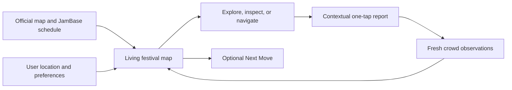
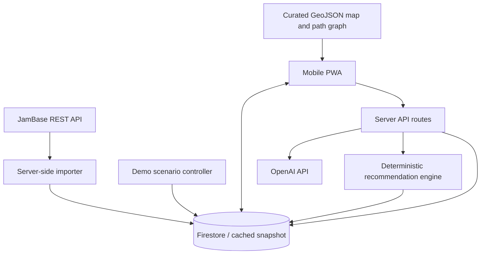

# CrowdList Product and Technical Specification

| Field | Value |
| --- | --- |
| Product | CrowdList |
| Category | Live festival intelligence |
| Document status | Hackathon build specification |
| Version | 1.0 |
| Date | August 2, 2026 |
| Primary event | OutsideLLMS 2026 / Outside Lands |
| Primary platform | Public mobile website, optionally installable as a PWA |
| Distribution | Outside Lands app → Experiences → OutsideLLMS gallery → CrowdList |

## 0. Decision register

These decisions are authoritative for the hackathon build. Later sections
elaborate them and must not contradict them.

| Area | Decision |
| --- | --- |
| Primary experience | Full-screen, interactive festival map |
| Product analogy | AllTrails for the temporary city of Outside Lands |
| Entry point | Direct link from the OutsideLLMS gallery; no marketing interstitial |
| Delivery | Public HTTPS mobile website; no installation or account required |
| Map artwork | Official 2026 Outside Lands patron-map PDF |
| Map engine | MapLibre GL JS with the PDF as a georeferenced image layer |
| Interactive map data | CrowdList-owned GeoJSON for stages, zones, paths, gates, routes, and heat cells; static directory information stays in the official map artwork |
| Planned music data | JamBase, imported server-side and cached |
| Live data | Fresh, time-decaying attendee reports; deterministic simulation for the judged demo |
| OpenAI role | Personalization, report interpretation, and grounded explanations behind the map |
| Conversational UI | Secondary `Ask CrowdList` sheet only |
| Recommendation UI | Optional suggestion pill and route overlay; never the home screen |
| Crowd representation | Qualitative aggregate activity and comfort, never exact occupancy or raw user dots |
| Accounts | None for P0; anonymous local session |
| Audio recognition | Outside P0; human-confirmed song signals only if time remains |
| Official-app boundary | Extend the Outside Lands app; do not rebuild its lineup, schedule planner, official alerts, static map directory, FAQ, ticketing, or experiences catalog |
| Submission uncertainty | Confirm whether “OpenAI site product” means a standalone site or a required ChatGPT App surface |

### P0 build contract

The judged build is complete when a visitor can open the gallery link, explore
the live-styled map immediately, inspect a stage, see JamBase-backed schedule
context, submit a two-tap crowd report, and watch that report visibly change the
map and an optional recommendation. Everything else is subordinate.

## 1. Executive summary

CrowdList helps a festival attendee answer one recurring question:

> Given what I like, what is scheduled, what is actually happening, how crowded
> each area feels, and how far away I am, where should I go next?

CrowdList combines three layers of information:

1. **Planned truth:** JamBase event, artist, venue, and schedule data.
2. **Live truth:** time-decaying observations contributed by people at the
   festival.
3. **Personal truth:** the attendee's tastes, must-see artists, crowd tolerance,
   current position, and stated intent.

The product is an **AllTrails-style live festival map**. It makes the temporary
city of Outside Lands legible: current and upcoming performances, walking paths,
stage activity, crowd comfort, entrances, amenities, and the attendee's own
position. Stage Pulse, reporting, routing, and recommendations appear as map
layers or dismissible sheets.

An optional **Next Move** suggestion can identify a destination, departure time,
route, reason, tradeoff, confidence level, and alternatives. It enhances the map
but never replaces or visually dominates it.

The project is distributed as an OpenAI-powered website. The winning project is
expected to appear through the Outside Lands app's `Experiences` entry, which
links to the OutsideLLMS project gallery and functions as a lightweight festival
“app store.” CrowdList therefore requires no App Store installation and must
deliver value immediately inside a mobile browser or in-app webview.

### One-sentence pitch

> CrowdList turns the official Outside Lands map into a living festival guide,
> combining JamBase schedules, live crowd signals, and OpenAI personalization.

### Tagline

> Know what's happening. Make your next move.

## 2. Product decision

CrowdList is **not** primarily:

- Another festival schedule.
- A passive crowd heatmap.
- A generic festival chatbot.
- A social location-sharing network.
- An automatic song-recognition app.
- A safety or crowd-capacity system.

CrowdList is a **live spatial layer** over official and community festival data.

The product succeeds when a user confidently takes an action: go, stay, leave,
or choose an alternative. Every feature in the hackathon build must either
improve that decision or establish trust in it.

### 2.1 Core product loop



### 2.2 Product principles

1. **Map first.** Open on the grounds, keep spatial context visible, and express
   results through layers, markers, routes, and sheets.
2. **Grounded over clever.** Generative output must be grounded in application
   data and must not invent schedules, locations, or crowd conditions.
3. **Honest uncertainty.** Show source, recency, and confidence. Avoid false
   precision.
4. **Useful before network effects.** JamBase-backed schedules and personalized
   planning must work before any crowd reports exist.
5. **Contribution without friction.** Most live reports should require one tap.
6. **Coarse location by design.** Stage-zone presence is sufficient; individual
   paths and exact public locations are not.
7. **Demo reliability.** The hackathon demo must work deterministically without
   depending on venue connectivity or a critical mass of users.

## 3. Goals and non-goals

### 3.1 Hackathon goals

- Deliver an immediately understandable mobile experience.
- Demonstrate a real JamBase integration, visibly attributed.
- Demonstrate a meaningful, constrained OpenAI capability.
- Show a live observation changing the map and an optional recommendation in
  real time.
- Provide a useful map and schedule with zero community contributions.
- Make scheduled, observed, and inferred information visibly distinct.
- Produce a repeatable 90-second to three-minute demo.
- Establish a credible path into the official festival app.
- Open from the OutsideLLMS gallery into a useful map state without login,
  installation, or mandatory onboarding.
- Make the use of OpenAI visible, meaningful, and easy to explain.

### 3.2 Product goals after the hackathon

- Become the live intelligence module embedded in festival applications.
- Build a trusted stage-by-time dataset of live festival conditions.
- Improve discovery while respecting user must-see commitments.
- Create crowd-verified stage timelines and setlists.
- Provide attendees with a useful and shareable post-festival memory.
- Give organizers privacy-preserving operational insight.

### 3.3 Non-goals for the hackathon

- Native App Store or Play Store distribution.
- Precise crowd counts or capacity claims.
- Background location tracking.
- Individual friend tracking.
- Full user accounts or social profiles.
- Production-grade abuse detection.
- Automated music recognition as a critical dependency.
- Ticket sales, food ordering, merchandise, or payments.
- A complete organizer dashboard.
- Automatic ingestion of every festival.
- General-purpose conversational search.
- Emergency routing or safety guarantees.
- Full lineup browsing or artist-directory pages.
- A personal schedule builder or favorites system.
- Reproducing official festival alerts, FAQs, policies, tickets, food listings,
  amenity directories, or the Experiences catalog.
- Replacing the Outside Lands app as the authoritative festival guide.

### 3.4 Boundary with the official Outside Lands app

CrowdList is opened from the official app and should return value that the
official app does not already provide. It may repeat a minimal piece of official
context—such as the artist currently scheduled at a tapped stage—but must not
rebuild the complete destination around that context.

| Outside Lands app owns | CrowdList adds |
| --- | --- |
| Full lineup and artist discovery pages | Live activity attached to stage locations |
| Schedule grid, favorites, and planning | What is actually happening now |
| Official static festival map and directory | Animated crowd/activity overlay on that map |
| Official alerts and operational messages | Clearly labeled community observations |
| Food, drinks, amenities, policies, and FAQs | Fresh line/crowd signals only when they affect movement |
| Tickets, wristbands, transportation, and logistics | Crowd-aware stage-to-stage movement |
| Experiences catalog | One focused live-map experience |

Product boundary rules:

1. Show only `now` and `next` performance context on the map; link or defer to
   the official app/site for the complete schedule.
2. Do not build schedule saving, favorites, lineup search, artist biographies,
   ticketing, static directories, or official-alert replicas.
3. Use the official patron map as the familiar canvas, then add only interactive
   live layers and routes.
4. Treat JamBase as entity/schedule context for live features, not as a reason to
   build a second festival guide.
5. Prefer an obvious `Back to Outside Lands` path for information CrowdList does
   not own.

## 4. Target audience

### 4.1 Primary persona: the adaptive explorer

An attendee with several favorite artists who also wants to discover new music.
They make repeated tradeoffs between taste, distance, schedule conflicts, crowd
comfort, and the desire to stay with friends.

Primary needs:

- Know where to go now.
- Understand what will be sacrificed by leaving or staying.
- Avoid arriving after a set begins.
- Discover a good nearby alternative.
- Avoid unexpectedly uncomfortable crowds.

### 4.2 Secondary persona: the superfan correspondent

An attendee with deep knowledge of one or more artists who enjoys confirming
set starts, songs, and other live details.

Primary needs:

- Make expertise useful to other fans.
- Preserve an accurate record of the performance.
- Receive meaningful recognition for reliable contributions.

### 4.3 Future persona: festival operations

An organizer who wants a coarse, privacy-preserving view of crowd movement,
schedule delays, and information gaps.

This persona informs the data model, but no organizer interface is required for
the hackathon build.

## 5. Jobs to be done

### JTBD-1: choose the next set

> When several sets overlap, help me choose the best next destination based on
> my priorities so I do not spend the festival comparing schedule grids.

### JTBD-2: react to live changes

> When a stage is delayed, unexpectedly packed, ending early, or difficult to
> reach, update my plan before I waste the transition window.

### JTBD-3: make discovery safe

> When I have an open schedule window, recommend an artist that fits my taste
> and current context without risking a must-see set.

### JTBD-4: understand recommendation tradeoffs

> When CrowdList recommends something, show me the reason and the cost so I can
> trust or reject it quickly.

### JTBD-5: contribute live truth

> When I arrive at a stage, let me report the situation in seconds and show me
> that the report improved the shared picture.

### JTBD-6: remember the day

> After the festival, show me the artists and songs I experienced without
> requiring me to document everything manually.

## 6. Information model and truth states

Every user-visible fact must have one of three truth states.

| State | Definition | Example | Presentation |
| --- | --- | --- | --- |
| Scheduled | Supplied by JamBase or a festival source | Artist scheduled at 5:30 | “Scheduled” and JamBase attribution |
| Observed | Explicitly reported or confirmed by attendees | Set began at 5:34 | “Confirmed by 5 people · 2m ago” |
| Inferred | Calculated from time, location, or aggregate signals | Crowd appears to be growing | “CrowdList estimate” with confidence |

The UI must never silently promote an inferred fact to an observed fact or an
observed fact to official schedule data.

Every live fact should carry:

- `sourceType`
- `observedAt`
- `expiresAt`
- `confidence`
- `uniqueReporterCount`, where applicable

## 7. Scope and priority

### 7.1 P0: required for the judged demo

| Capability | Requirement |
| --- | --- |
| Festival seed | Outside Lands schedule and artist records cached from JamBase or a JamBase-derived snapshot |
| Live grounds map | Georeferenced, mobile festival map with interactive stage zones, route graph, current position, and crowd layer |
| Stage Pulse | Scheduled artist, progress, live condition, freshness, and recent reports |
| Reporting | One-tap crowd and status observations |
| Realtime | A new report updates map activity and stage state without reload |
| Preference tuning | Optional one-tap energy, space, proximity, and discovery controls |
| Next Move | Compact, optional recommendation with a grounded explanation and route |
| Ask CrowdList | Secondary OpenAI sheet that translates a constraint-rich request into visible map filters, ranking, and route state |
| Demo control | Deterministic scenario controls or timed demo sequence |
| Attribution | Visible JamBase attribution and compliant event links |

### 7.2 P1: build only after P0 is stable

- Voice preference entry.
- Natural-language or voice report parsing.
- Alternative recommendations.
- Installable PWA metadata.
- Basic offline cache of the festival snapshot.
- Crowd-aware route weights.
- Additional live signal types validated with organizers.

### 7.3 P2: post-hackathon

- Dedicated music-recognition provider.
- Reputation-weighted setlist verification.
- Anonymous background stage-zone presence.
- Friend groups and shared constraints.
- Push notifications and Live Activities.
- Route accessibility preferences.
- Organizer dashboard.
- Artist and superfan activations.
- Multi-festival ingestion and operations tooling.
- Current-song submission and confirmation.
- My Day timeline and post-event recap.

## 8. Information architecture

The P0 application is a map-first website with contextual bottom sheets and one
hidden demo surface. It should feel closer to AllTrails or a ski-resort map than
a conventional tabbed festival schedule. The gallery link should land directly
on the map, not on a marketing page.

```text
/                       primary attendee experience and share URL
├── /onboarding          optional preference refinement
├── /stages/:stageId      deep-linkable stage sheet/page
├── /my-day               P2
└── /demo                 hidden, local/demo access only
```

P0 should not use permanent bottom navigation. The full-screen map remains the
canvas while draggable sheets expose Next Move, Stage Pulse, reporting, and
route details. P1 may add compact `Explore`, `Schedule`, and `My Day` controls.
Reporting is contextual and should open from a stage sheet rather than occupy a
permanent navigation item.

### 8.1 Primary mobile layout

```text
┌──────────────────────────────────┐
│ CrowdList          Now ▾    ◎    │  compact header
│                                  │
│          FULL-SCREEN MAP         │
│                                  │
│   ◉ Lands End       ))) SOMA     │  animated stage beacons
│       ░░░ crowd field ░░░        │
│            ╲                     │
│             ╲ highlighted route │
│              ● You               │
│                                  │
│  [Crowds] [Schedule] [Ask ✦]     │  map controls
│  ┌────────────────────────────┐  │
│  │ Suggested: Twin Peaks · 9m │  │  compact, optional pill
│  └────────────────────────────┘  │
└──────────────────────────────────┘
```

Opening a stage, report form, route, or Ask CrowdList uses a draggable sheet
over the lower portion of the map. The map remains visible behind every sheet.
Only explicit user action may expand a sheet beyond half the viewport.

### 8.2 Map interaction states

| State | Entered by | Map behavior | Exit |
| --- | --- | --- | --- |
| Browse | Initial load or reset | All stages visible; no route emphasized | Tap a stage/control |
| Inspect | Tap stage beacon | Selected stage emphasized; Stage Pulse sheet opens | Dismiss sheet or select another stage |
| Navigate | Tap `Take me there` or accept suggestion | Route, ETA, destination beacon, and recenter control appear | Clear route or arrive |
| Report | Tap `Report` from a stage | Stage remains selected; compact report sheet opens | Submit or dismiss |
| Ask | Tap `Ask ✦` | Map dims slightly but remains interactive; secondary sheet opens | Apply result or dismiss |

Applying Ask or preference changes returns to Browse or Navigate with a brief
visual diff: changed stage ranking, filter chips, and route pulse. State must be
recoverable with the browser Back action without leaving the site unexpectedly.

## 9. Experience flows

### 9.1 First-use map and optional preference tuning

Goal: create enough preference data for a more personal recommendation without
blocking the first useful map view.

Steps:

1. Render the map immediately with a useful non-personalized state based on time
   and the current festival schedule.
2. Present optional, one-tap map tuning rather than a separate planning flow.
3. Ask for crowd preference:
   - “Put me in the energy”
   - “Balanced”
   - “Give me room”
4. Optionally ask for a discovery/energy preference.
5. Ask for location permission only after the map explains the benefit.
6. If denied, let the user choose a current stage manually.
7. Apply the preference to map activity and optional suggestions.

Authentication is not required. Store preferences against a random local
session identifier.

### 9.2 Map-first interaction hierarchy

The map is the only primary surface. Next Move appears as a compact suggestion
pill above the map controls, for example `Suggested: SOMA · 5 min`. It must not
cover meaningful map content or open automatically into a large card. Selecting
the pill highlights the route and opens a draggable detail sheet with rationale,
alternatives, and controls; dismissing it returns to the unchanged map.

For an unpersonalized gallery visitor, the map remains fully explorable while a
subtle suggestion pill shows the best time-and-location-aware option available
from the current schedule. Lightweight chips inside the expanded sheet let the
user tune it without typing:

- More energy
- More room
- Closer
- Surprise me
- Must-see only

Selecting a chip immediately re-ranks the visible stage options and redraws the
route. Favorite lineup artists and prior choices refine later recommendations.
The primary loop remains visual and direct.

A secondary `Ask CrowdList` action opens an optional conversational sheet for
constraint-rich requests such as:

> I want electronic music, have 40 minutes, and need to be at Lands End by 6.

OpenAI parses the request into structured preferences and constraints. The
deterministic engine ranks eligible performances, closes or minimizes the sheet,
and expresses the result back on the map as a route and Next Move sheet. Chat is
an input shortcut, never the main destination or the place where results live.

The recommendation card contains:

- Recommended artist and stage.
- “Leave in N minutes” or “Go now.”
- Walking time.
- Set start and end.
- One-sentence reason.
- One explicit tradeoff.
- Confidence indicator.
- Primary action: `Take me there`.
- Secondary actions: `Alternatives` and `Tune recommendation`.

Example:

> **Head to Twin Peaks in 6 minutes**
>
> Barry Can't Swim starts at 5:30. It is a 9-minute walk, matches your
> electronic favorites, and the crowd is still comfortable.
>
> **Tradeoff:** You will miss the final 8 minutes at Sutro.

When a recommendation changes because of new live information, show a concise
reason:

> Updated: Lands End is delayed and newly reported as packed.

### 9.3 Detailed map flow

1. Open directly into a north-oriented, georeferenced, full-screen map
   constrained to the festival grounds.
2. Show the attendee's position and heading, or their manually chosen stage.
3. Render interactive paths, gates, stages, and zones above the official map;
   leave its static directory labels in the base artwork.
4. Render qualitative crowd activity above the static grounds layer.
5. Show a compact Next Move suggestion pill without automatically drawing a
   route or opening a sheet.
6. Tap a stage marker to open a compact Stage Pulse sheet.
7. Select the suggestion pill or `Take me there` to emphasize the route, ETA,
   and destination beacon.

Primary map controls:

- Recenter / current location.
- Now / later time selector.
- Crowd layer toggle.
- Now / next performer labels toggle.
- Current route clear/reset.

The user must be able to explore stages, inspect activity, and navigate without
ever opening recommendation or conversational UI.

Marker content:

- Stage name.
- Current or next artist.
- Set progress ring.
- Crowd label.
- Live-status icon.

Color must not be the only way crowd state or confidence is conveyed.

The map should support one-handed pan, pinch zoom, recenter, and north-reset.
Unlike a normal city map, the camera should not pan far beyond the festival
boundary.

### 9.4 Report flow

When a user arrives at or opens a stage:

1. Ask “How is it here?”
2. Present one-tap crowd choices:
   - Light
   - Comfortable
   - Busy
   - Packed
3. Optionally ask one follow-up:
   - Great energy
   - Long line
   - Set delayed
   - Artist is playing
4. Submit optimistically.
5. Confirm impact: “Added to Twin Peaks · live picture updated.”

P1 natural-language entry:

> “The west entrance is moving fast, but it is packed near the front.”

The server parses it into structured signals and returns a preview for user
confirmation before publishing.

### 9.5 Stage Pulse flow

The stage page contains:

1. **Now:** current scheduled and observed performance state.
2. **Pulse:** crowd level, direction of change, energy, and freshness.
3. **Next:** upcoming performances at this stage.
4. **Reports:** short recent structured observations.
5. **Setlist:** P2 current-song confirmations and recent history.
6. **Action:** navigate here or submit a report.

### 9.6 My Day flow (P2)

My Day is built from explicit `Take me there` actions, stage-zone arrival, and
manual confirmation. It must not claim that a user saw a full set from a brief
location observation.

Possible labels:

- “You headed to...”
- “You checked in at...”
- “Likely heard...”
- “You confirmed...”

## 10. Functional requirements

### 10.1 Festival and schedule

- **FR-FEST-001:** The system shall display one configured festival and its
  date range.
- **FR-FEST-002:** The system shall import or seed JamBase event and artist
  identifiers where available.
- **FR-FEST-003:** The system shall support a curated override for stage,
  coordinates, and performance times missing from JamBase.
- **FR-FEST-004:** The system shall preserve source attribution per imported
  record.
- **FR-FEST-005:** The client shall remain usable when the JamBase API is
  temporarily unavailable.

### 10.2 Preferences

- **FR-PREF-001:** The user shall be able to tune crowd comfort, energy,
  proximity, and discovery through one-tap controls.
- **FR-PREF-002:** Ask CrowdList may capture temporary genre, artist, time, or
  destination constraints without creating a parallel schedule planner.
- **FR-PREF-003:** The user shall be able to specify a crowd-comfort preference.
- **FR-PREF-004:** The user shall be able to select a current stage manually.
- **FR-PREF-005:** Preferences shall persist locally without registration.
- **FR-PREF-006:** The user shall be able to clear all CrowdList preferences and
  return to the neutral live map in one action.

### 10.3 Recommendation

- **FR-REC-001:** When the user requests or expands Next Move, the system shall
  return one primary recommendation and at least one alternative when eligible
  performances exist.
- **FR-REC-002:** Each recommendation shall identify the performance, stage,
  departure timing, walking estimate, reason, tradeoff, and confidence.
- **FR-REC-003:** The recommendation shall not reference data absent from the
  supplied context.
- **FR-REC-004:** Must-see conflicts shall be explicitly disclosed.
- **FR-REC-005:** Expired live observations shall not influence the score.
- **FR-REC-006:** New material live observations shall trigger recalculation.
- **FR-REC-007:** A deterministic fallback explanation shall exist if the AI
  service is unavailable.

### 10.4 Live reporting

- **FR-LIVE-001:** A user shall be able to submit a structured report in no more
  than two taps after opening the report sheet.
- **FR-LIVE-002:** Reports shall carry event, stage, session, and timestamp.
- **FR-LIVE-003:** Reports shall expire according to signal type.
- **FR-LIVE-004:** Duplicate rapid reports from one session shall be throttled.
- **FR-LIVE-005:** The aggregate stage state shall update in real time.
- **FR-LIVE-006:** Single-source observations shall be labeled as early signals.
- **FR-LIVE-007:** Conflicting reports shall reduce confidence.

### 10.5 Map

- **FR-MAP-001:** The map shall display every configured stage.
- **FR-MAP-002:** Stage markers shall show current or next performance and crowd
  state.
- **FR-MAP-003:** The user shall be able to select a stage manually as their
  current location.
- **FR-MAP-004:** The map shall remain functional without precise device
  location.
- **FR-MAP-005:** Crowd state shall be communicated with text/iconography in
  addition to color.
- **FR-MAP-006:** The map shall display a route from the current/manual position
  to the recommended stage.
- **FR-MAP-007:** Routing shall use a curated festival path graph rather than a
  public street-directions API.
- **FR-MAP-008:** The map shall visually distinguish public paths, restricted
  areas, stage zones, entrances, and accessible routes when known.
- **FR-MAP-009:** Raw attendee point locations shall never be displayed as the
  public heatmap.
- **FR-MAP-010:** The camera shall remain bounded to the festival grounds plus a
  small orientation margin.

### 10.6 Setlist (P2)

- **FR-SET-001:** A user shall be able to propose a current song for the active
  performance.
- **FR-SET-002:** Other users shall be able to confirm or dispute the proposal.
- **FR-SET-003:** A song shall be marked confirmed only after the configured
  agreement threshold is met.
- **FR-SET-004:** The UI shall distinguish proposed, likely, and confirmed
  songs.
- **FR-SET-005:** Music-recognition output, if added, shall count as one signal
  rather than final truth.

### 10.7 Distribution and runtime

- **FR-DIST-001:** The public project URL shall open directly to an interactive
  map state.
- **FR-DIST-002:** Map exploration shall not require installation, login,
  location permission, or preference setup.
- **FR-DIST-003:** The site shall work in a normal mobile browser and common
  iOS/Android in-app webviews.
- **FR-DIST-004:** The site shall not depend on popups, a new browser window, or
  preserved referrer headers.
- **FR-DIST-005:** The first meaningful frame shall contain the official map and
  current schedule state before live and AI requests finish.
- **FR-DIST-006:** Campaign parameters shall be accepted only from an allowlist
  and shall not control arbitrary redirects or executable content.
- **FR-DIST-007:** The site shall preserve normal browser Back behavior and offer
  a clear return path to official Outside Lands content for schedule, lineup,
  policy, directory, and ticket information.

### 10.8 Ask CrowdList

- **FR-ASK-001:** Ask CrowdList shall be secondary to the map and opened only by
  explicit user action.
- **FR-ASK-002:** It shall translate a request into a validated set of preference
  changes, filters, candidate IDs, or route intent.
- **FR-ASK-003:** Its result shall be expressed on the map; the conversation
  transcript shall not become the main results view.
- **FR-ASK-004:** It shall reference only configured artists, performances,
  stages, routes, and live facts provided in context.
- **FR-ASK-005:** The user shall be able to undo the resulting map/filter changes
  in one action.
- **FR-ASK-006:** Failure or timeout shall leave the map usable and preserve its
  previous state.

## 11. Recommendation system

### 11.1 Separation of responsibilities

Ordinary application code shall:

- Select eligible performances.
- Calculate time windows.
- Calculate walking cost.
- Apply must-see constraints.
- Calculate freshness and confidence.
- Score and rank candidates.

OpenAI shall:

- Convert natural-language intent into structured preferences.
- Convert optional natural-language reports into structured candidate signals.
- Produce a concise explanation from the top candidates and their reason codes.

The model shall not be the system of record or the sole ranking engine.

### 11.2 Candidate eligibility

A performance is eligible when:

- It is active or begins within the configured horizon, initially 60 minutes.
- The user can arrive before the configured latest-useful-arrival time.
- It is not cancelled.
- It has enough schedule data to evaluate.

The engine may allow an already-started performance if the remaining duration
after estimated arrival exceeds a minimum, initially 20 minutes.

### 11.3 Candidate score

All component scores are normalized to `0..1`.

```text
score =
    0.30 * tasteFit
  + 0.20 * mustSeePriority
  + 0.10 * discoveryValue
  + 0.10 * scheduleUrgency
  + 0.10 * liveEnergyFit
  + 0.10 * crowdComfortFit
  + 0.05 * dataConfidence
  - 0.15 * walkingCost
  - 0.15 * conflictCost
  - 0.10 * staleDataPenalty
```

Weights are initial heuristics, not learned values. They should be configurable
and adjusted for explicit intent. For example, “I want somewhere calm” increases
`crowdComfortFit`; “surprise me” increases `discoveryValue`.

### 11.4 Reason codes

The engine shall produce reason codes before generating prose:

- `MUST_SEE`
- `HIGH_TASTE_MATCH`
- `GOOD_DISCOVERY_MATCH`
- `STARTING_SOON`
- `ACTIVE_WITH_TIME_REMAINING`
- `SHORT_WALK`
- `CROWD_COMFORT_MATCH`
- `ENERGY_MATCH`
- `HIGH_LIVE_CONFIDENCE`
- `SCHEDULE_CONFLICT`
- `LONG_WALK`
- `CROWD_MISMATCH`
- `LOW_LIVE_CONFIDENCE`
- `REPORTED_DELAY`

### 11.5 Recommendation confidence

Recommendation confidence is separate from crowd confidence. It considers:

- Schedule completeness.
- Location availability.
- Number of taste signals.
- Freshness of relevant live state.
- Difference between first- and second-ranked candidates.

Use labels rather than percentages in the primary UI:

- High confidence
- Good option
- Limited live data

## 12. Live signal aggregation

### 12.1 Signal types and suggested lifetime

| Signal | Values | Initial lifetime |
| --- | --- | --- |
| Crowd level | light, comfortable, busy, packed | 10 minutes |
| Energy | low, steady, high | 10 minutes |
| Line | none, moving, long | 8 minutes |
| Performance status | not_started, active, delayed, ended | Until superseded or scheduled boundary |
| Entrance condition | clear, moving, congested | 5 minutes |
| Current song | proposed title/artist | Song duration or 8 minutes |

### 12.2 Report weight

For report `r`:

```text
weight(r) =
  reporterReliability(r.session)
  * proximityConfidence(r)
  * exp(-ageMinutes(r) / decayConstant(r.type))
```

P0 defaults:

- `reporterReliability = 1.0`
- `proximityConfidence = 1.0` for demo and `0.7` when location is unavailable
- Type-specific time decay

P2 reliability can incorporate prior agreement without creating a public social
score.

### 12.3 Crowd label aggregation

Map crowd labels to ordinal values:

```text
light = 0
comfortable = 1
busy = 2
packed = 3
```

Compute the weighted median rather than the mean to limit the effect of
outliers. Round only to one of the four named states.

Confidence should rise with:

- Unique recent reporters.
- Agreement between reports.
- Verified stage proximity.
- Recency.

Confidence should fall with:

- Conflicting reports.
- Reports from one session.
- Missing location.
- Rapid coordinated submissions.

Suggested display thresholds:

| Condition | Label |
| --- | --- |
| No live reports | No live data |
| One recent report | Early signal |
| 2–4 agreeing reporters | Medium confidence |
| 5+ agreeing reporters | High confidence |

These are product labels, not statistical guarantees.

## 13. Setlist trust model

Setlists are valuable but secondary to the P0 decision experience.

### 13.1 Song states

```text
proposed -> likely -> confirmed
                  \-> disputed
```

- **Proposed:** one human or recognition-provider signal.
- **Likely:** at least two independent agreeing signals and no material dispute.
- **Confirmed:** configured human-agreement threshold reached.
- **Disputed:** conflicting candidate has meaningful support.

### 13.2 Sources

- Manual song entry.
- Search against an external track catalog, if available.
- Dedicated music-recognition provider.
- Human confirmation.

OpenAI must not be used as a music fingerprinting system.

### 13.3 Abuse controls

- One active proposal per session per performance.
- Rate-limit repeated votes.
- Require stage proximity for high-weight votes when available.
- Preserve competing candidates until confidence resolves.
- Allow an organizer or moderator correction path in P2.

## 14. JamBase integration

### 14.1 Purpose

JamBase is the canonical source for planned live-music entities. CrowdList shall
not duplicate fuzzy artist identity logic when a stable JamBase identifier is
available.

### 14.2 API usage

Base URL:

```text
https://api.data.jambase.com/v3
```

Authentication:

```http
Authorization: Bearer ${JBD_API_KEY}
```

Expected operations:

- Search `/events` by festival name.
- Resolve the chosen event by exact JamBase identifier.
- Resolve performers through embedded records or `/artists`.
- Cache artist imagery, genres, external identifiers, and source URLs when
  included in the plan/response.
- Store JamBase `dateModified` for refresh decisions.

### 14.3 Import strategy

For the hackathon:

1. Run a server-side import once.
2. Review the returned Outside Lands record manually.
3. Save a normalized cached snapshot.
4. Add curated stage and coordinate overrides where the source lacks them.
5. Serve the app from CrowdList's database or bundled demo snapshot.

After the hackathon:

- Use `dateModifiedFrom` delta synchronization.
- Process deletion tombstones.
- Preserve source links and identifiers.
- Log import diffs for review.

### 14.4 Attribution

On plans that require attribution:

- Display an official JamBase mark or “Powered by JamBase.”
- Keep it visible on views displaying JamBase-backed content.
- Link attribution to JamBase with `rel="nofollow"`.
- Link each event to the primary source ticket URL, or fall back to its JamBase
  event URL.
- Do not rewrite the supplied source URL.

### 14.5 Failure behavior

- Never expose the API key to the browser bundle.
- Retain the last valid snapshot when refresh fails.
- Retry `429` and `5xx` responses with bounded exponential backoff.
- Surface stale import state only in internal diagnostics; the attendee app
  should continue from cached data.

## 15. OpenAI integration

### 15.1 Supported tasks

| Task | Input | Output |
| --- | --- | --- |
| Preference parsing | User sentence + allowed genres/artists | Structured preference patch |
| Report parsing | User sentence + current stage context | Structured candidate report |
| Recommendation explanation | Ranked candidates + reason codes | Short grounded explanation |

### 15.2 Structured output contract

Illustrative recommendation explanation schema:

```json
{
  "recommendedPerformanceId": "performance_123",
  "leaveInMinutes": 6,
  "reasonCodes": [
    "HIGH_TASTE_MATCH",
    "STARTING_SOON",
    "CROWD_COMFORT_MATCH"
  ],
  "tradeoffCode": "LEAVE_CURRENT_SET_EARLY",
  "explanation": "Head to Twin Peaks in six minutes...",
  "alternativePerformanceIds": ["performance_456"]
}
```

The server shall validate:

- All referenced IDs exist in the supplied candidates.
- All reason codes were supplied by the deterministic engine.
- The explanation meets the length limit.
- The response contains no unsupported factual claims.

If validation fails, use deterministic templates.

### 15.3 Prompt constraints

System instructions shall require the model to:

- Use only supplied facts.
- Never invent an artist, stage, time, report, or distance.
- State uncertainty compactly.
- Prefer actionable language.
- Return the required schema only.
- Avoid safety guarantees.
- Avoid claiming a person attended a performance based only on intent.

### 15.4 Data minimization

Do not send:

- Exact location history.
- Unnecessary device identifiers.
- Raw audio unless a future feature explicitly requires and discloses it.
- Full user report history when only aggregate stage context is needed.

## 16. Technical architecture

### 16.1 Hackathon recommendation

- **Client:** mobile-first React/Next.js TypeScript PWA.
- **Map renderer:** MapLibre GL JS with a lightweight vector/raster basemap and
  CrowdList-owned GeoJSON overlays.
- **UI:** responsive components over a full-screen map with draggable sheets.
- **Server:** Next.js server routes or equivalent serverless functions.
- **Realtime data:** Firebase Firestore subscriptions.
- **Session:** random client session ID with local persistence.
- **Official data:** JamBase REST API, imported and cached server-side.
- **AI:** OpenAI API, called server-side with structured outputs.
- **Hosting:** a HTTPS-capable platform that supports server routes and
  environment secrets.

Expo remains a valid post-hackathon native path, but a PWA reduces installation,
build, and judge-onboarding risk.

### 16.2 System diagram



### 16.3 Security boundary

Only the server may access:

- `JBD_API_KEY`
- `OPENAI_API_KEY`
- Administrative demo mutation credentials

The client may read public festival state and submit constrained reports. Server
validation or Firestore security rules must prevent arbitrary modification of
aggregate state.

### 16.4 Distribution and runtime contract

Organizer-provided distribution flow:

```text
Outside Lands mobile app
    ↓ Experiences
OutsideLLMS project gallery
    ↓ CrowdList project card
CrowdList public HTTPS site
```

The site shall:

- Open from a normal link without installation.
- Work inside common iOS and Android in-app browsers/webviews.
- Avoid popups and new-window dependencies.
- Render the map shell before requesting location or preferences.
- Require no account for map, schedule, recommendation, or reporting.
- Preserve useful state across refresh through local storage.
- Provide a normal browser fallback when opened outside the festival app.
- Include Open Graph title, description, and a strong project-card image for the
  OutsideLLMS gallery.
- Accept optional campaign/source parameters without changing core behavior.
- Avoid assuming the referrer header will survive an in-app redirect.

Suggested entry URL:

```text
https://crowdlist.example/?festival=outside-lands-2026&source=osl-experiences
```

The page should present a meaningful first frame even when location, realtime,
or OpenAI requests are still pending:

- Official patron map.
- Current time and festival day.
- Current/next scheduled artist at each stage.
- “Choose where you are” and optional “Use my location” controls.

The site should progressively enhance after first paint with:

- Stage Pulse subscriptions.
- Heat and activity animation.
- Personalized Next Move.
- OpenAI-powered recommendation explanations and optional intent/report parsing.

Recommended gallery metadata:

```text
Name: CrowdList
Category: Live festival intelligence
Headline: Know what's happening. Make your next move.
Description: A live Outside Lands map that combines official schedules, crowd
signals, and OpenAI to find your best next set.
CTA: Open live map
```

The gallery card image should show the official map, one glowing route, two or
three live stage beacons, and a concise Next Move sheet. It should communicate
the product before the visitor reads the description.

### 16.5 OpenAI site-product interpretation

This specification interprets the organizer's phrase “ChatGPT/OpenAI site
product” as a public website whose product experience materially uses OpenAI
APIs. OpenAI powers personalization, structured interpretation, and grounded
explanations behind the map; the primary UI is not chat-based. It does not
currently assume that submission must be a ChatGPT App, Custom GPT, or Apps SDK
component.

Confirm the exact submission requirement before implementation. If a ChatGPT
App is mandatory, retain the CrowdList web UI but add the required ChatGPT app
surface and MCP tool server as a separate adapter. Do not redesign the map as a
chat transcript.

## 17. Data model

The following shapes are conceptual TypeScript interfaces. They may be adapted
to Firestore collections.

```ts
type SourceType = "scheduled" | "observed" | "inferred";
type CrowdLevel = "light" | "comfortable" | "busy" | "packed";
type PerformanceStatus =
  | "scheduled"
  | "not_started"
  | "active"
  | "delayed"
  | "ended"
  | "cancelled";

interface Festival {
  id: string;
  jambaseId?: string;
  name: string;
  startsAt: string;
  endsAt: string;
  timezone: string;
  sourceUrl?: string;
  importedAt?: string;
  sourceModifiedAt?: string;
}

interface Artist {
  id: string;
  jambaseId?: string;
  name: string;
  imageUrl?: string;
  genres: string[];
  sourceUrl?: string;
  externalIds?: Record<string, string>;
}

interface Stage {
  id: string;
  festivalId: string;
  name: string;
  mapX: number;
  mapY: number;
  latitude?: number;
  longitude?: number;
}

interface MapFeature {
  id: string;
  festivalId: string;
  type:
    | "boundary"
    | "path"
    | "restricted"
    | "entrance"
    | "stage_zone"
    | "amenity"
    | "landmark";
  geometry: GeoJSON.Geometry;
  properties: Record<string, string | number | boolean>;
  source: "outside_lands" | "open_data" | "curated";
}

interface RouteNode {
  id: string;
  festivalId: string;
  longitude: number;
  latitude: number;
  stageId?: string;
  entranceId?: string;
}

interface RouteEdge {
  id: string;
  fromNodeId: string;
  toNodeId: string;
  geometry: GeoJSON.LineString;
  baseWalkSeconds: number;
  accessible: boolean | "unknown";
  restricted: boolean;
}

interface HeatCell {
  id: string;
  festivalId: string;
  geometry: GeoJSON.Point | GeoJSON.Polygon;
  activityWeight: number;
  crowdLevel?: CrowdLevel;
  confidence: "early" | "medium" | "high";
  calculatedAt: string;
  validUntil: string;
}

interface Performance {
  id: string;
  festivalId: string;
  stageId: string;
  artistId: string;
  scheduledStart: string;
  scheduledEnd: string;
  observedStart?: string;
  observedEnd?: string;
  status: PerformanceStatus;
  scheduleSource: "jambase" | "festival" | "curated";
}

interface LiveReport {
  id: string;
  festivalId: string;
  stageId: string;
  performanceId?: string;
  sessionId: string;
  type: "crowd" | "energy" | "line" | "performance_status" | "entrance";
  value: string;
  createdAt: string;
  expiresAt: string;
  proximityConfidence?: number;
  inputMode: "tap" | "text" | "voice" | "demo";
}

interface StagePulse {
  stageId: string;
  crowdLevel?: CrowdLevel;
  crowdTrend?: "falling" | "steady" | "building";
  performanceStatus?: PerformanceStatus;
  confidence: "none" | "early" | "medium" | "high";
  uniqueReporterCount: number;
  calculatedAt: string;
  validUntil: string;
}

interface UserPreferences {
  sessionId: string;
  preferredGenres?: string[];
  discoveryPreference: number;
  energyPreference: "low" | "balanced" | "high";
  crowdPreference: "energy" | "balanced" | "space";
  maxWalkMinutes?: number;
  currentStageId?: string;
  temporaryConstraints?: {
    artistIds?: string[];
    requiredStageId?: string;
    requiredArrivalTime?: string;
  };
}

interface Recommendation {
  id: string;
  sessionId: string;
  performanceId: string;
  alternativePerformanceIds: string[];
  leaveInMinutes: number;
  walkingMinutes: number;
  reasonCodes: string[];
  tradeoffCode?: string;
  explanation: string;
  confidence: "limited" | "good" | "high";
  generatedAt: string;
  inputsVersion: string;
}
```

### 17.1 Suggested collections

```text
festivals/{festivalId}
festivals/{festivalId}/artists/{artistId}
festivals/{festivalId}/stages/{stageId}
festivals/{festivalId}/performances/{performanceId}
festivals/{festivalId}/reports/{reportId}
festivals/{festivalId}/stagePulses/{stageId}
sessions/{sessionId}
sessions/{sessionId}/recommendations/{recommendationId}
```

## 18. Server interfaces

Exact routing may change, but responsibilities should remain stable.

### `GET /api/festivals/:festivalId`

Returns the cached festival, stages, artists, performances, and attribution
metadata required for initial render.

### `POST /api/recommendations`

Request:

```json
{
  "festivalId": "outside-lands-2026",
  "sessionId": "session_abc",
  "currentStageId": "sutro",
  "currentTime": "2026-08-07T17:12:00-07:00",
  "intent": "something energetic but not packed"
}
```

Response:

```json
{
  "recommendation": {},
  "alternatives": [],
  "liveDataAsOf": "2026-08-07T17:11:30-07:00"
}
```

### `POST /api/reports`

Accepts a constrained structured report. It validates allowed values, applies
rate limits, writes the report, and triggers or schedules stage aggregation.

### `POST /api/reports/parse`

P1 endpoint. Parses text into a candidate structured report but does not publish
until the user confirms it.

### `POST /api/admin/demo-state`

Demo-only endpoint protected by a local secret or disabled in public production.
It advances the scripted festival scenario.

### `POST /api/admin/import-jambase`

Administrative server-side endpoint or script. It shall never be callable by an
untrusted browser session.

## 19. Festival map and navigation

### 19.1 Available Outside Lands data

As of this specification, Outside Lands publicly provides:

- A one-page 2026 patron-map PDF linked from its official information page.
- An official mobile app that displays the map and current schedule.
- Public schedule and lineup pages.
- Public pages describing the seven stages and their Golden Gate Park areas.
- Public entrance, accessibility, transportation, and amenity information.

No documented public Outside Lands developer API, GeoJSON feed, routing graph,
or live crowd feed has been identified. The website/app may use private content
services internally; CrowdList must not depend on undocumented endpoints without
explicit organizer permission.

The hackathon team should ask organizers for:

- A vector map, GIS export, or high-resolution transparent map asset.
- Stage, path, and gate coordinates.
- The internal schedule/content feed, if participants may use it.
- Accessibility and restricted-path data.

### 19.2 Recommended map implementation

Use **MapLibre GL JS** as the renderer. It provides geospatial camera behavior,
GeoJSON sources, symbols, lines, fills, heatmaps, and smooth animation without
locking the data model to a proprietary map vendor.

The map comprises five independently controlled layers:

```text
5  UI and animation       Next Move, destination beacon, stage pulse, fog/energy
4  Live intelligence      heat cells, crowd trend, active routes
3  Festival operations    stages, entrances, restricted/ADA zones
2  Festival paths         curated walk graph and named paths
1  Visual base            georeferenced official patron map and fallback basemap
```

The official PDF is the approved visual base for the hackathon build. Rasterize
it to a high-resolution WebP, crop it to the usable map artwork, and georeference
it as a MapLibre image source. Interactive geometry must still be stored
separately as GeoJSON so it can be selected, routed, animated, and made
accessible. The PDF supplies the visual character; CrowdList supplies the
behavior.

Keep the original PDF URL and attribution in project metadata so the base can be
refreshed if Outside Lands publishes a revision.

### 19.3 Geometry preparation

For the hackathon:

1. Render the official PDF at two or three times the target screen resolution.
2. Crop and compress the map artwork to WebP while retaining readable labels.
3. Establish a WGS84 bounding box covering the festival grounds.
4. Align the raster using at least four recognizable Golden Gate Park anchors.
5. Validate the transform against the seven stage locations and entrances.
6. Place interactive stage zones above the raster at their known locations:
   - Lands End / Polo Field
   - Twin Peaks / Hellman Hollow
   - Sutro / Lindley Meadow
   - Panhandle
   - SOMA / Marx Meadow
   - Dolores'
   - Duboce Triangle / McLaren Pass
7. Draw only the primary attendee paths required for the demo.
8. Add interactive entrances; retain static amenity labels from the PDF without
   rebuilding the directory.
9. Validate route geometry and travel estimates with organizers or an attendee
   familiar with the grounds.

Because the patron map is illustrated rather than a guaranteed GIS survey, the
overlay may require a mild perspective/affine adjustment. GPS and route logic
must use the GeoJSON coordinates, not pixel measurements from the PDF.

Use a small map-authoring script or a visual GeoJSON editor after the hackathon;
do not hard-code complex coordinates inside UI components.

### 19.4 Grounds routing

Public street-routing APIs are unsuitable inside a temporary festival because
fences, closures, checkpoints, one-way flows, and temporary paths are absent or
wrong. CrowdList shall route over a curated node-edge graph.

Use Dijkstra or A* with an adjustable edge cost:

```text
edgeCost =
  baseWalkSeconds
  * liveCongestionMultiplier
  + accessibilityPenalty
  + restrictionPenalty
```

P0 may set `liveCongestionMultiplier = 1` and use verified stage-to-stage ETAs
as a fallback. A small matrix remains useful when the path graph is incomplete:

```ts
const fallbackWalkingMinutes = {
  "lands-end:sutro": 8,
  "lands-end:twin-peaks": 14,
  "sutro:twin-peaks": 9
};
```

Do not ask a language model to estimate walking time or invent a route.

### 19.5 Heatmap rendering

The visual heatmap is generated from aggregate `HeatCell` records, never raw
user coordinates. For P0, stage-zone centroids and simulated aggregate points
are sufficient. Later versions may use privacy-preserving grid or H3 cells.

Render separate concepts carefully:

- **Crowd comfort:** light through packed, using a smooth translucent field.
- **Activity/energy:** animated stage beacon or waveform, not the density color.
- **Confidence:** opacity or texture plus a readable label.
- **Movement:** short directional particles only when aggregate flow is known.

The heatmap must not imply person-level tracking or exact occupancy.

### 19.6 Outside Lands visual language

CrowdList should feel native to the wooded, foggy, playful character of Outside
Lands while retaining an original identity.

Recommended visual motifs:

- Slow fog wisps at the map edges, disabled under reduced motion.
- Cypress/eucalyptus green geographic context.
- International-orange route highlights.
- Stage-specific accent colors.
- Soft concentric sound waves around an active performance.
- Small firefly-like particles for high energy, capped for performance.
- A disco shimmer for a newly confirmed live moment.
- A destination beacon that expands like a vinyl groove.

Animation semantics must be stable:

- Faster pulse means higher reported energy, not a larger crowd.
- Larger heat field means broader crowd activity.
- Lower opacity means lower confidence or older data.
- Fog is decorative and must not encode risk or navigation state.

Use characters or branded artwork already present in the approved patron map as
part of that base. Keep CrowdList's new interactive icons and animations
visually compatible but separately authored so their meaning remains clear.

### 19.7 Performance budget

- Target smooth interaction on a typical recent phone.
- Keep simultaneous animated stage beacons under eight.
- Pause nonessential animation when the page is hidden.
- Respect `prefers-reduced-motion`.
- Aggregate heat points before sending them to the client.
- Avoid rendering individual attendee markers.
- Use a static/list fallback if WebGL is unavailable.

## 20. Realtime behavior

### 20.1 Update sequence

1. Client submits report.
2. Server validates and stores it.
3. Stage aggregate is recalculated.
4. Firestore publishes the new Stage Pulse.
5. Connected clients update the map and stage page.
6. Sessions whose active recommendation materially depends on that stage are
   recalculated or marked stale.
7. The affected client displays a recommendation-change notice.

### 20.2 Material change

A change is material when it may alter a decision, including:

- Crowd state crosses a category boundary.
- A performance changes to delayed, active, ended, or cancelled.
- A recommendation's destination becomes infeasible.
- Walking time or current location changes substantially.
- A must-see performance approaches its leave-now threshold.

Do not regenerate AI prose for every minor report. Recalculate deterministic
state first and invoke explanation generation only for material changes.

## 21. Privacy, safety, and abuse resistance

### 21.1 Privacy

- Use a random session ID; do not require an email.
- Treat location permission as optional.
- Store stage-zone identity instead of precise history whenever possible.
- Do not expose reporter identity to other attendees.
- Expire raw presence observations rapidly.
- Provide a clear “Stop using my location” control.
- Avoid sending location to third-party AI services.

### 21.2 Safety language

Allowed:

- “Reported as packed.”
- “Crowd appears to be building.”
- “Limited live data.”

Disallowed:

- “This route is safe.”
- “The stage is at 84% capacity.”
- “There is no crowd risk.”
- “Emergency route.”

### 21.3 Abuse controls

P0:

- Server-side enum validation.
- Per-session report cooldown.
- One effective vote per signal type per short window.
- Input length limits.
- No arbitrary HTML or public free-text feed.

P2:

- Proximity-based weight.
- Device and network anomaly detection.
- Reliability based on historical agreement.
- Coordinated-report detection.
- Organizer moderation and incident review.

## 22. Reliability and degraded modes

| Failure | Required behavior |
| --- | --- |
| JamBase unavailable | Use last imported snapshot |
| OpenAI unavailable | Use deterministic preference defaults and explanation templates |
| Firestore realtime unavailable | Show cached state and “Live updates paused” |
| Location denied | Ask user to select current stage |
| No crowd reports | Show “No live data” and rely on schedule |
| Conflicting reports | Lower confidence and show disagreement, not a definitive state |
| Map asset fails | Provide list-based stage navigation |
| Poor connectivity | Cache festival shell and schedule where practical |

No degraded mode may invent live data outside the explicit demo environment.

## 23. Accessibility

- Target WCAG 2.2 AA for the attendee experience.
- Maintain minimum touch targets of approximately 44 by 44 CSS pixels.
- Do not encode crowd state with color alone.
- Support screen-reader names for map markers and controls.
- Respect reduced-motion preferences.
- Keep primary actions reachable with one thumb on common mobile sizes.
- Use plain-language recommendation explanations.
- Provide a list alternative to the visual map.
- Ensure report controls are usable without dragging or precise gestures.

## 24. Analytics and success metrics

### 24.1 North-star metric

**Meaningful map actions per active festival session**

A meaningful map action occurs when a user inspects a stage, starts a route,
accepts a Next Move, changes a map layer, or contributes a live report. This
captures the primary map experience without forcing every useful session through
recommendations.

### 24.2 Supporting metrics

- Time from site open to interactive map.
- Stage inspections per active session.
- Routes started per active session.
- Recommendation acceptance rate.
- Alternative-selection rate.
- Recommendation rejection reason.
- Contextual report conversion rate.
- Reports per active session.
- Percentage of stages with fresh live data.
- Recommendation changes caused by live signals.
- Must-see conflict avoidance rate.
- My Day completion/share rate, when implemented.

### 24.3 Trust metrics

- Percentage of facts with visible source state.
- Report agreement rate.
- Correction/dispute rate.
- Percentage of recommendations using stale live data.
- AI response validation failure rate.

### 24.4 Suggested events

```text
onboarding_started
onboarding_completed
map_interactive
map_layer_changed
recommendation_viewed
recommendation_accepted
recommendation_rejected
alternative_selected
stage_viewed
report_prompted
report_submitted
report_parse_confirmed
recommendation_changed_live
location_permission_result
jambase_import_completed
ai_fallback_used
```

Do not include exact coordinates or raw report text in general analytics.

## 25. Demo mode

The hackathon demo must be scripted but clearly identified internally as a
simulation. It must not contaminate production/community data.

### 25.1 Required scenario

Initial state:

- User likes electronic and indie music.
- User prefers energetic but not packed crowds.
- User is currently at Sutro.
- Lands End is the initial best recommendation.

Demo transition:

- A report says Lands End is packed and delayed.
- The report is structured and published.
- Lands End Stage Pulse updates.
- The recommendation changes to Twin Peaks.
- The explanation names the new live tradeoff.

### 25.2 Demo controls

- Reset scenario.
- Advance simulated time.
- Publish preconfigured report.
- Toggle JamBase/API failure indicator.
- Toggle OpenAI failure to demonstrate deterministic fallback, if useful.

### 25.3 Demo script

1. **Problem, 10 seconds:** “The official map shows where things are. CrowdList
   shows what the festival feels like right now.”
2. **Living map, 25 seconds:** Open directly on the official map; pan across
   animated stages, schedule progress, paths, and crowd activity.
3. **Stage inspection, 20 seconds:** Tap Lands End and reveal JamBase-backed
   schedule context plus fresh Stage Pulse evidence.
4. **Live contribution, 20 seconds:** Submit a two-tap packed/delayed report.
5. **Visible response, 25 seconds:** Show the map heat, stage beacon, and
   confidence change without reloading.
6. **Optional intelligence, 25 seconds:** Expand the suggestion pill and show the
   revised route to Twin Peaks with a grounded explanation. Briefly open the
   secondary Ask CrowdList sheet, enter one constraint-rich request, and show
   the answer become map filters and a route rather than a chat transcript.
7. **Close, 15 seconds:** “JamBase knows what is scheduled. The crowd knows what
   is happening. CrowdList makes both visible.”

## 26. Testing strategy

### 26.1 Unit tests

- Candidate eligibility around start/end boundaries.
- Walking-time lookup and missing-route fallback.
- Score calculation and intent-adjusted weights.
- Expired live-report exclusion.
- Weighted-median crowd aggregation.
- Confidence reduction for disagreement.
- Must-see conflict detection.
- AI response ID and reason-code validation.

### 26.2 Integration tests

- JamBase response normalization into local schema.
- Report submission to Stage Pulse update.
- Stage Pulse update to recommendation invalidation.
- OpenAI failure to deterministic fallback.
- Location denial to manual-stage selection.

### 26.3 End-to-end tests

- Open the gallery URL and interact with the map before granting permissions.
- Inspect a stage and its schedule context.
- Submit a crowd report and observe the updated stage state.
- Expand Next Move and start a route.
- Execute the full scripted demo transition.
- Refresh and retain local preferences.

### 26.4 Manual demo checklist

- Production URL opens from a QR code on cellular data.
- No secret appears in browser source or network-visible client configuration.
- Reset demo works.
- JamBase attribution is visible.
- Map works on at least one iPhone-sized and one Android-sized viewport.
- The complete story can be demonstrated in under three minutes.
- A backup recording or screenshots exist in case venue connectivity fails.

## 27. Build sequence

The implementation sequence should optimize for a complete vertical slice.

### Phase 1: foundation

- Scaffold the mobile PWA.
- Define seed data and the normalized schema.
- Convert and georeference the official patron-map PDF.
- Build the full-screen map, stage zones, paths, and map interaction sheets.
- Add JamBase attribution.

### Phase 2: complete live map loop

- Build Stage Pulse.
- Add one-tap reporting and realtime aggregation.
- Make reports visibly update map activity and confidence.

### Phase 3: optional decision intelligence

- Implement lightweight preferences.
- Implement deterministic ranking.
- Build the compact suggestion pill, detail sheet, and route overlay.

### Phase 4: sponsor intelligence

- Connect the JamBase importer or verified snapshot.
- Add OpenAI preference/report parsing and explanation generation.
- Add validated fallbacks.

### Phase 5: demo hardening

- Add demo controls and scripted state.
- Test degraded modes.
- Polish mobile interaction and accessibility.
- Record the backup demo.

### Phase 6: stretch

- Add alternatives.
- Add current-song proposal/confirmation.
- Add a minimal My Day timeline.

## 28. Acceptance criteria

The P0 hackathon build is complete only when all of the following are true:

1. The OutsideLLMS project link opens a useful map without login or installation.
2. The map shell and current schedule render before any permission prompt.
3. A new user can reach a personalized, grounded recommendation in under 45
   seconds.
4. The recommendation names a real configured artist, performance, and stage.
5. The recommendation shows timing, reason, tradeoff, and confidence.
6. JamBase-backed data is cached server-side and visibly attributed.
7. No JamBase or OpenAI secret is present in the client bundle.
8. The map shows every configured stage and remains usable without location.
9. A user can submit a valid live report in two taps.
10. A submitted report changes Stage Pulse without a page reload.
11. A material stage change can alter the Next Move recommendation.
12. Scheduled, observed, and inferred facts are distinguishable.
13. The experience does not present an unsupported exact crowd percentage.
14. OpenAI output is schema-validated and has a deterministic fallback.
15. An Ask CrowdList request can change visible map filters and routing without
    inventing artists, stages, times, distances, or live conditions.
16. The scripted demo resets and runs predictably.
17. The primary story can be demonstrated in under three minutes.
18. The site remains useful when there are no live reports.

## 29. Risks and mitigations

| Risk | Consequence | Mitigation |
| --- | --- | --- |
| Insufficient users | Empty or misleading live layer | Schedule-first value, contextual prompts, explicit “no live data,” demo simulation |
| JamBase lacks stage detail | Incomplete schedule mapping | Curated stage override; ask sponsor for partner feed |
| Live music recognition fails | Broken headline demo | Keep recognition out of P0; use human proposal and confirmation |
| AI hallucinates | Loss of trust | Deterministic ranking, strict schema, ID validation, templates |
| Venue connectivity is poor | Demo/app failure | Cache snapshot, PWA shell, scripted local state, backup recording |
| Crowd reports are manipulated | Bad recommendations | Expiry, rate limits, agreement, proximity/reputation later |
| Location concerns | Permission refusal | Coarse zones, optional permission, manual stage selection |
| Feature sprawl | No complete demo | Enforce P0/P1 boundary and vertical build sequence |
| Official app already has schedule/map | Weak differentiation | Lead with live decision changes, not schedule browsing |
| “Crowd” implies safety accuracy | Liability and trust risk | Qualitative comfort labels, confidence, no safety claims |

## 30. Open questions

Resolve these in priority order:

1. Does the sponsor-provided JamBase Outside Lands record contain stage-level
   assignments and exact performance times?
2. Is a private/custom Outside Lands feed available to hackathon teams?
3. Which JamBase attribution terms apply to the sponsor/hackathon access?
4. Can organizers provide a higher-resolution raster or vector version of the
   official 2026 patron map?
5. Can organizers provide GIS/GeoJSON stage, path, gate, restricted, and
   accessible-route geometry?
6. Are stage-to-stage walking estimates available from organizers?
7. Can the build use a simulated future festival date while the buildathon takes
   place before the festival?
8. Does “ChatGPT/OpenAI site product” mean a standalone OpenAI-powered website,
   a ChatGPT App built with Apps SDK, a Custom GPT, or another submission type?
9. Which OpenAI capabilities or credits are provided at the event?
10. What project-card metadata, image dimensions, and URL requirements does the
    OutsideLLMS gallery impose?
11. Will the winning site open in the system browser or an Outside Lands in-app
    webview?
12. What live information may organizers be willing to validate during the
    actual festival?

## 31. Post-hackathon roadmap

### V1: festival pilot

- One real festival.
- Official schedule ingestion.
- Personalized Next Move.
- One-tap live reporting.
- Coarse Stage Pulse.
- Operational moderation tools.

### V1.5: trusted fan network

- Artist-specific contributor reliability.
- Set start/end verification.
- Crowd-verified songs.
- My Day recap and playlist export.
- Notifications for material recommendation changes.

### V2: embedded festival intelligence

- Official app SDK/module.
- Organizer live dashboard.
- Privacy-preserving passive stage-zone signals.
- Congestion-aware walking estimates.
- Shared group constraints.
- Accessible routing.

### V3: cross-festival graph

- Multi-festival preference profile.
- Discovery informed by real attendance behavior.
- Artist/superfan activations.
- Predictive crowd movement.
- Historical live-performance intelligence layered over the JamBase graph.

## 32. Business and distribution hypothesis

CrowdList should pursue B2B2C distribution rather than ask users to install a
separate app for every festival.

### Attendee product

- Free at the point of use.
- Opened through the official festival app, mobile web, or QR code.
- No registration required for core value.

### Organizer product

- White-label module or SDK.
- Privacy-preserving aggregate live state.
- Configurable stages, prompts, and official overrides.
- Operational dashboard and communications in later versions.

### Artist and sponsor product

- Contextual artist discovery.
- Superfan contribution programs.
- Branded, opt-in festival moments that do not distort recommendations.

CrowdList must not fund the product by selling precise attendee location data.

## 33. Defensibility

The language model, schedule, and map are not durable moats on their own.

The defensible asset is a trusted experiential graph keyed to stable live-music
entities:

```text
festival × stage × performance × time
    ├── actual start and end
    ├── crowd comfort and movement
    ├── delays and operational state
    ├── audience energy
    ├── fan-confirmed songs
    └── recommendation outcomes
```

JamBase supplies the durable identity graph. CrowdList accumulates the live
experiential graph and learns which tradeoffs lead to accepted decisions.

## 34. Messaging

### Landing-page headline

> The Outside Lands map, alive.

### Supporting copy

> CrowdList adds live stage energy, crowd comfort, movement, and fan reports to
> the familiar official map.

### Thirty-second pitch

> The Outside Lands app already handles the lineup, schedule, official map, and
> festival information. CrowdList adds the missing live layer. It combines
> JamBase performance context with fresh reports from fans on the ground, then
> turns the official map into a living view of stage energy, crowd comfort, and
> movement. OpenAI can interpret those signals when a fan wants help, while the
> map remains the product.

### Sponsor line

> Outside Lands supplies the place. JamBase knows what is scheduled. The crowd
> shows what is happening. CrowdList puts it all on the map.

## 35. External references

- OutsideLLMS 2026 event and challenge brief: <https://outsidellms.com/>
- Official Outside Lands information and map link: <https://sfoutsidelands.com/info/>
- Official 2026 patron map PDF: <https://sfoutsidelands.com/assets/maps/ol26-patron-map_73026.pdf>
- Official Outside Lands stage guide: <https://sfoutsidelands.com/stages/>
- Official Outside Lands schedule page: <https://sfoutsidelands.com/schedule/>
- JamBase Data overview: <https://data.jambase.com/data>
- JamBase API getting started: <https://data.jambase.com/api/docs/getting-started>
- JamBase API reference: <https://data.jambase.com/api/reference>
- JamBase attribution requirements: <https://data.jambase.com/api/docs/attribution>
- JamBase rate limits and quotas: <https://data.jambase.com/api/docs/rate-limits>
